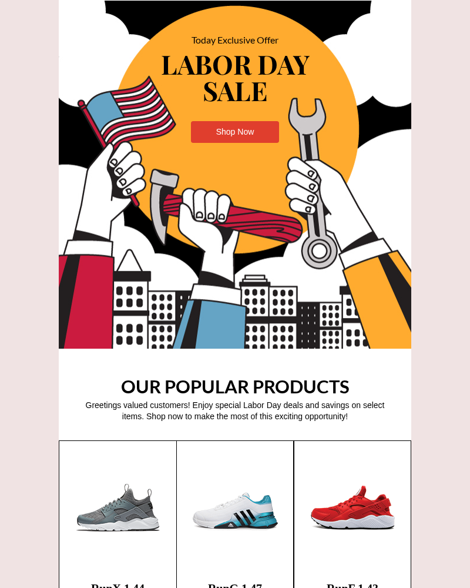

# Labor Day Deals

Email template for promoting Labor Day deals in the Retail industry, utilizing a marketing approach.



## Template Details

- **Industries:** Retail
- **Message Type:** Marketing
- **Tags:** sale, labordaydeals

## Files
- `index.html`: The improved, localized, and branded HTML template.
- `template.blade.php`: Ready-to-use Laravel Blade template with `asset()` helpers.
- `assets/`: Directory containing localized images and styles used in the template.

## Usage in Laravel

### 1. Store the Template
Place the `index.html` content in a Blade view (e.g., `resources/views/emails/labor-day-deals.blade.php`).

### 2. Handle Assets
Move the content of `assets/` to your public directory (e.g., `public/vendor/mail-templates/labor-day-deals/`) and update the paths in the HTML to use the `asset()` helper.

### 3. Send Email
```php
Mail::to($user)->send(new \App\Mail\GenericEmail([
    'view' => 'emails.labor-day-deals',
    'data' => [
        // Your dynamic data here
    ]
]));
```

---
*Created with ❤️ by **[LaravelMail.com](https://laravelmail.com)** - Your source for professional email templates.*
